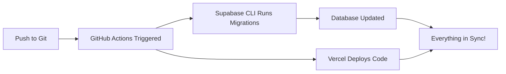

# Automated Database Migrations Setup

This project uses GitHub Actions to automatically apply Supabase database migrations whenever you push code changes to the main branch.

## One-Time Setup (5 minutes)

### Step 1: Get Your Supabase Credentials

1. **Go to your Supabase Dashboard**: https://app.supabase.com
2. **Get your Project Reference ID**:
   - Click on your project
   - Go to **Settings** → **General**
   - Copy the **Reference ID** (looks like: `abcdefghijklmnop`)

3. **Get your Database Password**:
   - Go to **Settings** → **Database**
   - You'll see your database password (you may have saved this when you created the project)
   - If you don't have it, you can reset it here

4. **Create a Supabase Access Token**:
   - Go to https://app.supabase.com/account/tokens
   - Click **Generate new token**
   - Give it a name like "GitHub Actions"
   - Copy the token (you won't see it again!)

### Step 2: Add GitHub Secrets

1. **Go to your GitHub repository**
2. Click **Settings** → **Secrets and variables** → **Actions**
3. Click **New repository secret** and add these three secrets:

   | Secret Name | Value | Where to Find |
   |-------------|-------|---------------|
   | `SUPABASE_PROJECT_REF` | Your project reference ID | Supabase Dashboard → Settings → General → Reference ID |
   | `SUPABASE_DB_PASSWORD` | Your database password | Supabase Dashboard → Settings → Database → Password |
   | `SUPABASE_ACCESS_TOKEN` | Your personal access token | https://app.supabase.com/account/tokens |

### Step 3: Test It!

1. **Push this code to your main branch**
2. **Go to**: GitHub → Actions tab
3. **Watch the "Supabase Database Migrations" workflow run**
4. **Check the logs** to confirm migrations were applied

## How It Works



1. You push code changes (including migration files in `supabase/migrations/`)
2. GitHub Action automatically runs
3. Supabase CLI applies all pending migrations to your database
4. Vercel deploys your updated code in parallel
5. Your app and database stay perfectly in sync ✅

## Workflow Trigger

The workflow runs when:
- You push to the `main` branch
- AND there are changes in `supabase/migrations/` directory

This means:
- ✅ Migrations only run when you actually have new migration files
- ✅ Prevents unnecessary runs on non-database changes
- ✅ Keeps your Actions usage minimal

## For Future Database Changes

1. Create a new migration file in `supabase/migrations/`:
   ```sql
   -- supabase/migrations/20260201_add_new_feature.sql
   ALTER TABLE my_table ADD COLUMN new_column TEXT;
   ```

2. Commit and push:
   ```bash
   git add supabase/migrations/
   git commit -m "feat: add new database column"
   git push origin main
   ```

3. **That's it!** The migration runs automatically in Supabase 🎉

## Manual Migration (If Needed)

If you ever need to run migrations manually:

```bash
# On your local machine (one-time setup)
brew install supabase/tap/supabase  # Mac
supabase link --project-ref YOUR_PROJECT_REF

# Run migrations
supabase db push
```

## Troubleshooting

### Workflow fails with "authentication error"
- Check that all three GitHub secrets are set correctly
- Verify your Supabase access token is still valid (they don't expire, but can be revoked)

### Workflow succeeds but changes aren't in database
- Check the workflow logs in GitHub Actions
- Verify the migration file is in `supabase/migrations/` directory
- Ensure the SQL syntax is correct

### Want to test without pushing to main
- Create a separate workflow file for development branches
- Or run migrations manually using Supabase CLI

## Security Notes

- ✅ GitHub Secrets are encrypted and never exposed in logs
- ✅ Only maintainers with repository access can modify secrets
- ✅ Secrets are NOT accessible in pull requests from forks
- ✅ Supabase Access Tokens can be revoked anytime from your Supabase account

## What About Rollbacks?

If you need to undo a migration:

1. Create a new migration file that reverses the changes:
   ```sql
   -- supabase/migrations/20260201_rollback_feature.sql
   ALTER TABLE my_table DROP COLUMN new_column;
   ```

2. Push it - the rollback runs automatically

**Never modify existing migration files** - always create new ones!

---

## Summary

**Before**: Push code → Deploy to Vercel → Remember to update database → Go to SQL Editor → Copy/paste SQL → Hope you didn't forget anything

**After**: Push code → Everything updates automatically ✨

No more manual database work!
